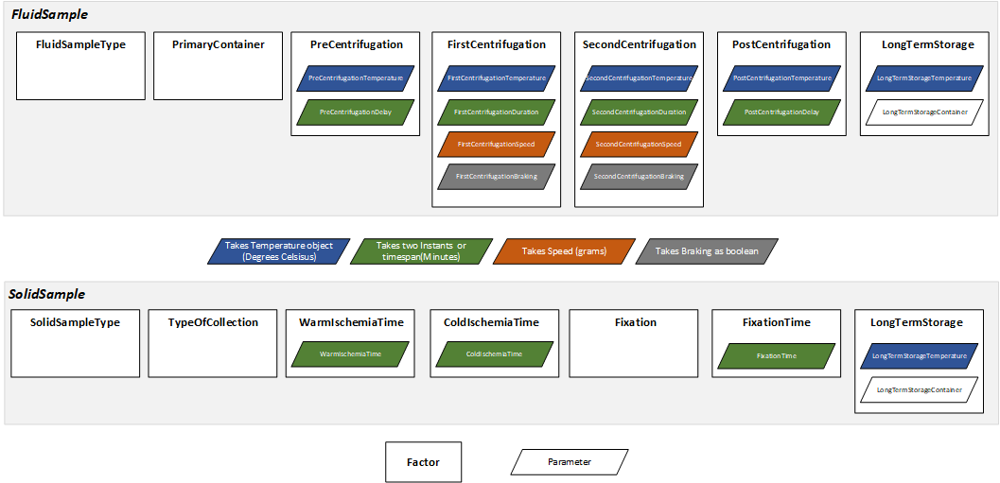

# SPRECLib

  [](http://badges.mit-license.org)


A Java library for the SamplePREanalyticalCode Version 2 from the [ISBER](https://www.isber.org/page/SPREC?&hhsearchterms=%22sprec%22)

#
### Getting started

Download the latest release and include the .jar file to your project. In the same folder where the .jar is in create a folder called ```spreclib_config``` and put the config.properties file inside it. 

#
### Terminology in SPRECLib
A SPREC is made up of seven factors, that define the most important pre-analytical factors of a sample. For example FluidSampleType, PrimaryContainer and PreCentrifugation are such factors. Each factor has a defined set of values, each containing a one or three character code. 

SPRECLib offers to obtain lists of the SPREC-Factors for the use in e.g. dropdown selects. Also SPRECLib offers a way to pass data such as temperature (degrees celsius), times (Java Instant), speed (grams) to obtain a factor.

You see an overview of the structure of SPRECLib in the picture below.


#
### Getting SPREC parts or values as Lists

To obtain lists of the SPREC values for each factor or parameter you need to instantiate the ListProvider for that part. There is a ListProvider for every factor and each parameter of a factor, if the factor is made up of multiple parameters. The contents of the ListProviders are called ListOptions, their name depends on the ListProvider that they come from.

```
FluidSampleTypeProvider provides a List of FluidSampleTypeOptions, PrimaryContainerListProvider provides a List of PrimaryContainerOptions...
```

To get a list of FluidSampleTypeOptions:

```
FluidSampleTypeListProvider fluidSampleTypeListProvider = new FluidSampleTypeListProvider();
List<FluidSampleTypeOption> fluidSampleTypeOptions = fluidSampleTypeListProvider.getList();
```

To get the english name of a ListOption, e.g. to use it in a GUI, call ```.getStringRepresentation();``` on the ```ListOption```

```
String nameInEnglish = fluidSampleTypeOption.getStringRepresentation();
```

### Getting the SPREC code of a sample

After you obtained the ListOptions for the sample, use either ```FluidSampleSprec``` or ```SolidSampleSprec``` to get the SPREC code. These classes provide a fluent interface to build the samples.

Example for a fluid sample:

```
  FluidSampleSprec fluidSampleSprec = new FluidSampleSprec();
  
  FluidSprecCode fluidSprecCode = fluidSampleSprec
    .withFluidSampleType(FluidSampleTypeOption)
    .withPrimaryContainer(PrimaryContainerOption)
    .withPreCentrifugation(PreCentrifugationOption)
    .withFirstCentrifugation(FirstCentrifugationOption)
    .withSecondCentrifugation(SecondCentrifugationOption)
    .withPreCentrifugation(PostCentrifugationOption)
    .withLongTermStorage(LongTermStorageOption)
    .getSprecCode();
```


Example for a solid Sample:
```
  SolidSampleSprec solidSampleSprec = new SolidSampleSprec();

  SolidSprecCode solidSprecCode = solidSampleSprec
    .withSolidSampleType(SolidSampleTypeOption)
    .withTypeOfCollection(TypeOfColletionOption)
    .withWarmIschemiaTime(WarmIschemiaTimeOption)
    .withColdIschemiaTime(ColdIschemiaTimeOption)
    .withFixation(FixationOption)
    .withFixationTime(FixationTimeOption)
    .withLongTermStorage(LongTermStorageOption)
    .getSprecCode();
```

You can pass null values instead of an option. This will lead to the code for that part to be replaced by "?" in the full code of that sample."?" is the default replacement. You can configure the replacement by changing it in the config.properties.


Calling ```.getSprecCode()``` will return a FluidSprecCode / SolidSprecCode object. To get the full SPREC code use:
```
String sprecCode = fluidSprecCode.getStringRepresentation();
```

To get the code for a specific part:
<p>
  
**Warning: This will return null if the part has not been set!** 

```
  FluidSampleSprec fluidSampleSprec = new FluidSampleSprec();
  
  FluidSprecCode sprecCode = fluidSampleSprec
    .withFluidSampleType(FluidSampleTypeOption)
    .getSprecCode();

  ICodePart fluidSampleTypeCode = sprecCode.getFluidSampleTypeCode();
  String fluidSampleTypeCodeString = fluidSampleTypeCode.getStringRepresentation();
```

### Passing values to SPRECLib

You can pass values to the ListProviders to obtain a ListOption if the passed value is valid in SPREC. If you pass an invalid value a checked exception is thrown.

The ListProviders for parameters that contain a temperature, time, speed or braking provide a valueOf-method.

To pass Time values use the Java class ```Instant``` that can be instantiated in many ways, such as EPOCH time in millis or seconds, dates, .... . 

To pass a Temperature, you need to instantiate a Temperature Object that takes a temperature in degrees celsius.  

To obtain a FirstCentrifugationOption to pass it to the Builder you should proceed like the following.

```
  Temperature temperature = new Temperature(20f);

  Instant startTime = Instant.ofEpochMilli(1577836800000L);
  Instant EndTime = Instant.ofEpochMilli(1577837700000L);

  FirstCentrifugationTemperatureOption firstCentrifugationTemperatureOption =
    new FirstCentrifugationTemperatureListProvider().valueOf(temperature);

  FirstCentrifugationDurationOption firstCentrifugationDurationOption =
    new FirstCentrifugationDurationListProvider().valueOf(startTime, EndTime);

  FirstCentrifugationSpeedOption firstCentrifugationSpeedOption =
    new FirstCentrifugationSpeedListProvider().valueOf(3000);
    
  FirstCentrifugationBrakingOption firstCentrifugationBrakingOption =
    new FirstCentrifugationBrakingListProvider().valueOf(true);

  FirstCentrifugationOption firstCentrifugationOption =
    this.firstCentrifugationListProvider.valueOf(
      firstCentrifugationTemperatureOption,
      firstCentrifugationDurationOption,
      firstCentrifugationSpeedOption,
      firstCentrifugationBrakingOption);
```
The valueOf-methods that take a temperature, instants, speed or braking will throw a checked Exception if the passed value is invalid in SPREC, means no corresponding value can be found in SPREC.
The valueOf-method of the FirstCentrifugationListProvider will throw a checked Exception if the passed combination is invalid in SPREC.

#### Temperatures can be passed to: 
- PreCentrifugationListProvider
- FirstCentrifugationListProvider
- SecondCentrifugationListProvider
- PostCentrifugationListProvider
- LongTermStorageListProvider

#### Instants can be passed to:
- WarmIschemiaTimeListProvider
- ColdIschemiaTimeListProvider
- FixationTimeListProvider
- PreCentrifugationDelayListProvider
- FirstCentrifugationDurationListProvder
- SecondCentrifugationDurationListProvider
- PostCentrifugationListProvider

Braking and Speed values can be passed to the CentrifugationListProviders.

## Acknowledgements

- [equalsverifier](https://github.com/jqno/equalsverifier) by jqno

## Authors

* *Christopher Meyer* - [Chris2996](https://github.com/chris2996)

## License

[](http://badges.mit-license.org)

- **[MIT license](http://opensource.org/licenses/mit-license.php)**
- Copyright 2020 © <a href="http://fvcproductions.com" target="_blank">Christopher Meyer</a>.
